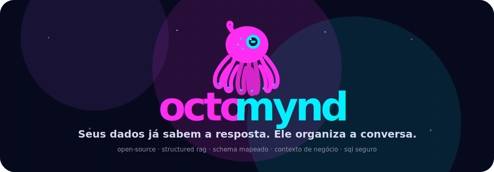
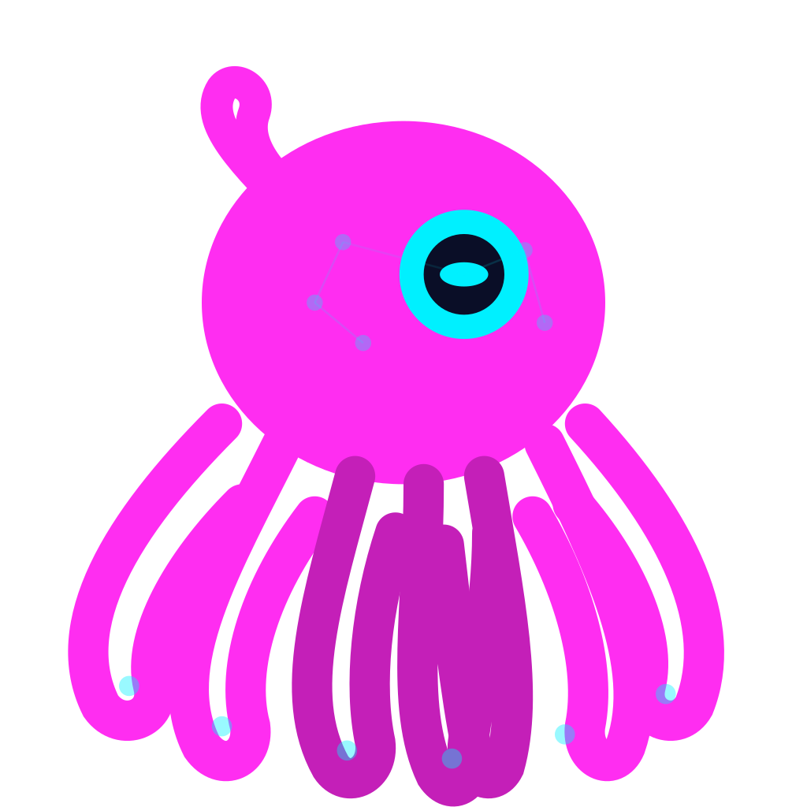

  

 

  
  
  
  

 

  <strong>Octomynd é um Structured RAG Studio para conversar com dados estruturados usando schema mapeado, contexto de negócio e SQL seguro.</strong>

  PostgreSQL first · local-first · open-source · BYO model · SQL read-only validado

---

## O que é

Octomynd nasce de uma ideia simples: **perguntar para um banco de dados não deveria depender de chute, prompt solto ou dashboard engessado**.

Ele conecta em uma base estruturada, entende o schema, recebe contexto de negócio e transforma perguntas em consultas SQL revisáveis. A resposta precisa vir com trilha: qual contexto foi usado, qual SQL foi gerado e quando o sistema não tem base suficiente para responder.

> **Não é chatbot genérico. É um tradutor de intenção para dados estruturados.**

## Como ele pensa

| Camada | Papel |
| --- | --- |
| **Fonte de dados** | PostgreSQL/Data Warehouse como origem inicial do produto. |
| **Schema mapeado** | Tabelas, colunas, tipos e relações viram contexto navegável. |
| **Contexto semântico** | Glossário, regras, filtros padrão e notas reduzem resposta genérica. |
| **SQL seguro** | Consultas read-only validadas antes de executar. |
| **Resposta auditável** | Resposta final com SQL e interpretação, sem esconder a mecânica. |

## Projetos

| Repositório | Descrição |
| --- | --- |
| [`octomynd`](https://github.com/Everson-s8/octomynd) | App principal: backend FastAPI, frontend React/Next e desktop Tauri. |
| [`octomynd-landing`](https://github.com/Octomynd/octomynd-landing) | Landing pública com a identidade rosa/neon do mascote Octomynd. |
| [`.github`](https://github.com/Octomynd/.github) | Perfil público e metadados da organização. |

## Princípios

- **Controle antes de mágica:** o usuário escolhe provider, modelo, API key e ambiente.
- **SQL visível:** se uma resposta depende de consulta, a consulta precisa aparecer.
- **Contexto importa:** schema puro não carrega regra de negócio sozinho.
- **Local-first:** desenvolvimento e uso individual sem depender de servidor central da organização.
- **Sem falsa certeza:** se a pergunta é fora do escopo, o produto precisa dizer isso.

## Status

Octomynd está em MVP ativo. A base já existe, mas o padrão antes do lançamento público é maior:

- melhorar qualidade das respostas;
- endurecer tratamento de perguntas fora de contexto;
- evoluir prompt profiles e contexto semântico;
- criar bases de teste reproduzíveis;
- preparar uma experiência mínima viável para instalação e uso por terceiros.

## Mascote

  

  <strong>O polvo não é decoração. Ele é a marca.</strong> 
  Ele representa o que o produto precisa fazer: conectar tentáculos de schema, contexto e SQL para chegar em uma resposta confiável.

---

  <a href="https://github.com/Octomynd/octomynd-landing"><strong>Ver landing</strong></a>
  ·
  <a href="https://github.com/Everson-s8/octomynd"><strong>Ver projeto principal</strong></a>

