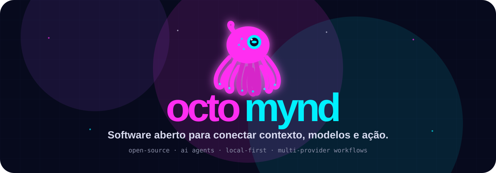

  

 

  
  
  

 

  <strong>Open-source software for local-first AI agents and multi-provider LLM workflows.</strong>

  local-first · open-source · bring your own provider · auditable workflows

---

## What Octomynd is

Octomynd builds focused tools for working with AI systems without hiding the important decisions behind a black box.

The ecosystem is local-first and provider-agnostic: people bring their own accounts, models and credentials, while the tools make context, execution and failure visible.

> **The goal is useful automation with an inspectable path from intent to result.**

## Featured project

| Project | Description |
| --- | --- |
| [**Maestro**](https://github.com/Everson-s8/octomynd-maestro) | Open-source desktop and CLI orchestrator for multi-provider LLM workflows, governed tasks and local execution. |

The Maestro beta is the current public release focus. Its documentation is available at [docs.octomynd.com/maestro](https://docs.octomynd.com/maestro).

The documentation and landing source repositories are maintained privately while their published sites are prepared for public access.

## Principles

- **Control before magic:** the user chooses providers, models, credentials and environments.
- **Local-first by default:** personal data and credentials stay on the user's machine.
- **Visible execution:** tasks, tool calls, failures and reviews should be inspectable.
- **Provider choice:** no single model or vendor should be required by the product.
- **No false certainty:** systems should expose gaps instead of inventing confidence.

## Status

Octomynd is an active open-source project. Maestro is currently in public beta preparation:

- improving the first-run experience;
- validating desktop distribution on clean machines;
- expanding provider and task recovery coverage;
- collecting feedback from early users.

## Mascote

  

  <strong>O polvo não é decoração. Ele é a marca.</strong> 
  Ele representa o que o produto precisa fazer: conectar tentáculos de schema, contexto e SQL para chegar em uma resposta confiável.

---

  <a href="https://github.com/Everson-s8/octomynd-maestro"><strong>View Maestro</strong></a>
  ·
  <a href="https://docs.octomynd.com/maestro"><strong>Read the docs</strong></a>
  ·
  <a href="https://github.com/Everson-s8/octomynd-maestro/discussions"><strong>Join the discussion</strong></a>

